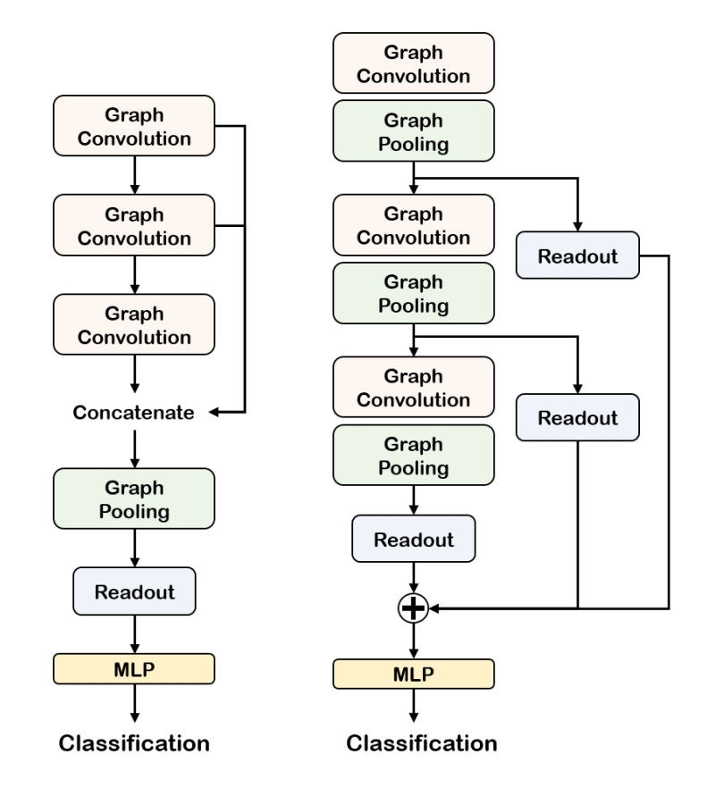
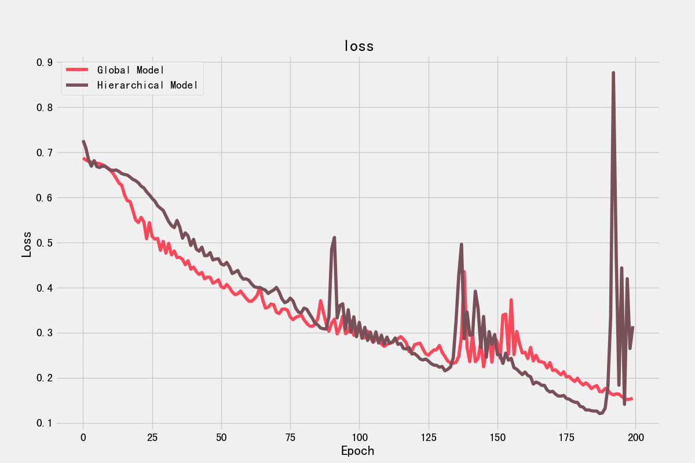

# SAGPool 图分类

## 简介

在[之前的文章](https://blog.csdn.net/zhouchen1998/category_10528560.html)中，我主要提及了节点级别的任务，这种任务的特点是不断对节点的特征进行聚合，每次聚合各个节点都会聚集邻居的信息，但是，**图的结构是不会变化的**。图分类则是一个图层面的任务，与节点层面的任务不同，它需要的是图数据的全局信息，既包括图的结构信息，也包括每个节点的属性信息。图分类任务说来也简单，给定多张图及其标签，要求学习一个由图到相应标签的图分类模型，模型的重点是如何学习一个较好的全图表示向量。

## SAGPool算法

图分类任务和视觉图像的分类任务类似，都需要对全局的信息进行融合学习。不妨回顾一下CNN中的处理思路，在卷积神经网络中，我们通常利用层次化池化来逐渐提取全局信息。得益于图像的栅格结构，池化操作能够非常简单高效地的实现并用于高阶信息的提取。然而，非规则的图结构数据使得池化的设计变得比较困难。

SAGPool（Self-Attention Pooling，自注意力池化）是层次化池化的一种实现，它的思路是通过图卷积从图中自适应学习到节点的重要性，然后利用TopK机制进行节点丢弃。

具体来看，使用GCN为每个节点赋予重要性得分，如下式所示。其中$\sigma$表示激活函数，$\tilde{A}$表示增加了自连接的邻接矩阵，$X$表示节点特征，$\Theta_{a t t} \in R^{N\times 1}$表示权重参数，这也是自注意力池化层引入的唯一参数。

$$
Z=\sigma\left(\tilde{D}^{-\frac{1}{2}} \tilde{A} \tilde{D}^{-\frac{1}{2}} X \Theta_{a t t}\right)
$$

根据重要性得分以及图的拓扑结构可以进行池化操作，下式就是TopK选择的过程，基于$Z$得分，只会有$\lceil k N\rceil$个节点继续保留。

$$
\mathrm{idx}=\operatorname{top-rank}(Z,\lceil k N\rceil), \quad Z_{\text {mask}}=Z_{\text {idx }}
$$

就这样，反复堆叠上述的自注意力池化层就可以进行图的池化，最后通过全局池化将各个图降维到同一维度即可。对算法细节感兴趣可以查看[原论文](https://arxiv.org/abs/1904.08082)。

## 数据集

本项目采用的是D&D数据集，这是一个包含1178个蛋白质结构的数据集，每个蛋白质用图结构表示，图中的节点为氨基酸，如果两个节点之间的距离小于6埃则它们之间有边相连，每个图分为酶和非酶两种类别之一。该数据集源于论文《Distinguishing enzyme structures from non-enzymes without alignments》，下载地址为[BaiduNetDisk](https://pan.baidu.com/s/1J3ZiiG0HVFajCLHiKiFWhg)(code: zczc)。

## 模型构建

在开始之前我们先来安装一个包`torch-scatter`，它是torch的一个拓展包，可以很方便地如下图般按照索引类来分别进行均值和最大值求解，安装可以通过pip安装，也可以通过下面的地址找到合适的版本安装。


```shell
https://s3.eu-central-1.amazonaws.com/pytorch-geometric.com/whl/torch-1.6.0.html
```

然后我们来构建模型，核心的TopK-rank等方法就不多赘述，可以查看文末的Github链接，下面是自注意力池化的具体实现，思路就是我上面说的利用GCN来进行节点评分。

```python
class SelfAttentionPooling(nn.Module):
    def __init__(self, input_dim, keep_ratio, activation=torch.tanh):
        super(SelfAttentionPooling, self).__init__()
        self.input_dim = input_dim
        self.keep_ratio = keep_ratio
        self.activation = activation
        self.attn_gcn = GraphConvolution(input_dim, 1)

    def forward(self, adjacency, input_feature, graph_indicator):
        attn_score = self.attn_gcn(adjacency, input_feature).squeeze()
        attn_score = self.activation(attn_score)

        mask = top_rank(attn_score, graph_indicator, self.keep_ratio)
        hidden = input_feature[mask] * attn_score[mask].view(-1, 1)
        mask_graph_indicator = graph_indicator[mask]
        mask_adjacency = filter_adjacency(adjacency, mask)
        return hidden, mask_graph_indicator, mask_adjacency
```

有了自注意力池化层，就可以定义模型了，论文提出了两种模型设计如下图，左边的模型是global模型，右边的模型是hierarchical模型，实验证明前者适合小图分类，后者适合大图分类。



```python
class ModelA(nn.Module):
    def __init__(self, input_dim, hidden_dim, num_classes=2):
        """
        SAGPool Global Model
        :param input_dim:
        :param hidden_dim:
        :param num_classes:
        """
        super(ModelA, self).__init__()
        self.input_dim = input_dim
        self.hidden_dim = hidden_dim
        self.num_classes = num_classes

        self.gcn1 = GraphConvolution(input_dim, hidden_dim)
        self.gcn2 = GraphConvolution(hidden_dim, hidden_dim)
        self.gcn3 = GraphConvolution(hidden_dim, hidden_dim)
        self.pool = SelfAttentionPooling(hidden_dim * 3, 0.5)
        self.fc1 = nn.Linear(hidden_dim * 3 * 2, hidden_dim)
        self.fc2 = nn.Linear(hidden_dim, hidden_dim // 2)
        self.fc3 = nn.Linear(hidden_dim // 2, num_classes)

    def forward(self, adjacency, input_feature, graph_indicator):
        gcn1 = F.relu(self.gcn1(adjacency, input_feature))
        gcn2 = F.relu(self.gcn2(adjacency, gcn1))
        gcn3 = F.relu(self.gcn3(adjacency, gcn2))

        gcn_feature = torch.cat((gcn1, gcn2, gcn3), dim=1)
        pool, pool_graph_indicator, pool_adjacency = self.pool(adjacency, gcn_feature,
                                                               graph_indicator)

        readout = torch.cat((global_avg_pool(pool, pool_graph_indicator),
                             global_max_pool(pool, pool_graph_indicator)), dim=1)

        fc1 = F.relu(self.fc1(readout))
        fc2 = F.relu(self.fc2(fc1))
        logits = self.fc3(fc2)

        return logits


class ModelB(nn.Module):
    def __init__(self, input_dim, hidden_dim, num_classes=2):
        """
        SAGPool Hierarchical Model
        :param input_dim:
        :param hidden_dim:
        :param num_classes:
        """
        super(ModelB, self).__init__()
        self.input_dim = input_dim
        self.hidden_dim = hidden_dim
        self.num_classes = num_classes

        self.gcn1 = GraphConvolution(input_dim, hidden_dim)
        self.pool1 = SelfAttentionPooling(hidden_dim, 0.5)
        self.gcn2 = GraphConvolution(hidden_dim, hidden_dim)
        self.pool2 = SelfAttentionPooling(hidden_dim, 0.5)
        self.gcn3 = GraphConvolution(hidden_dim, hidden_dim)
        self.pool3 = SelfAttentionPooling(hidden_dim, 0.5)

        self.mlp = nn.Sequential(
            nn.Linear(hidden_dim * 2, hidden_dim),
            nn.ReLU(),
            nn.Linear(hidden_dim, hidden_dim // 2),
            nn.ReLU(),
            nn.Linear(hidden_dim // 2, num_classes))

    def forward(self, adjacency, input_feature, graph_indicator):
        gcn1 = F.relu(self.gcn1(adjacency, input_feature))
        pool1, pool1_graph_indicator, pool1_adjacency = \
            self.pool1(adjacency, gcn1, graph_indicator)
        global_pool1 = torch.cat(
            [global_avg_pool(pool1, pool1_graph_indicator),
             global_max_pool(pool1, pool1_graph_indicator)],
            dim=1)

        gcn2 = F.relu(self.gcn2(pool1_adjacency, pool1))
        pool2, pool2_graph_indicator, pool2_adjacency = \
            self.pool2(pool1_adjacency, gcn2, pool1_graph_indicator)
        global_pool2 = torch.cat(
            [global_avg_pool(pool2, pool2_graph_indicator),
             global_max_pool(pool2, pool2_graph_indicator)],
            dim=1)

        gcn3 = F.relu(self.gcn3(pool2_adjacency, pool2))
        pool3, pool3_graph_indicator, pool3_adjacency = \
            self.pool3(pool2_adjacency, gcn3, pool2_graph_indicator)
        global_pool3 = torch.cat(
            [global_avg_pool(pool3, pool3_graph_indicator),
             global_max_pool(pool3, pool3_graph_indicator)],
            dim=1)

        readout = global_pool1 + global_pool2 + global_pool3

        logits = self.mlp(readout)
        return logits
```

## 模型训练

下面使用两种模型分别在数据集上进行训练和推理，global模型测试集准确率0.75，hierarchical模型测试集准确率0.72。下图是两个模型的实验对比图，设计的代码见文末Github。



## 补充说明

本文简单实现D&D数据集上实验自注意力池化进行图分类任务，内容参考《深入浅出图神经网络》以及SAGPool的论文，代码开放于[Github](https://github.com/luanshiyinyang/GNN)，欢迎star和fork。