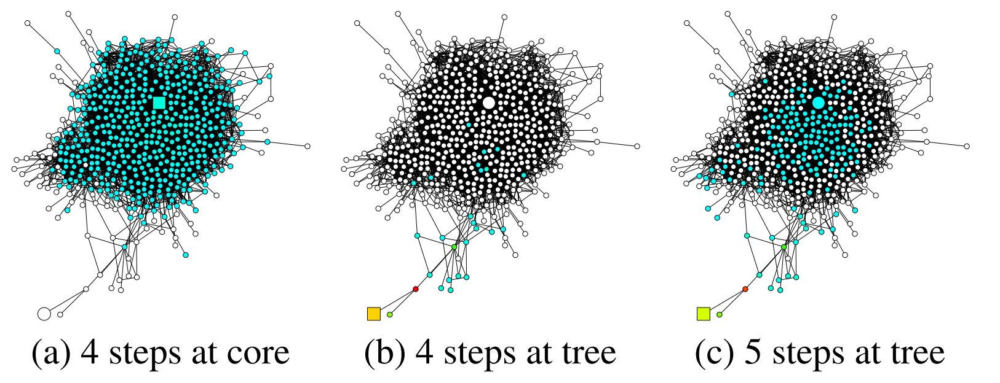
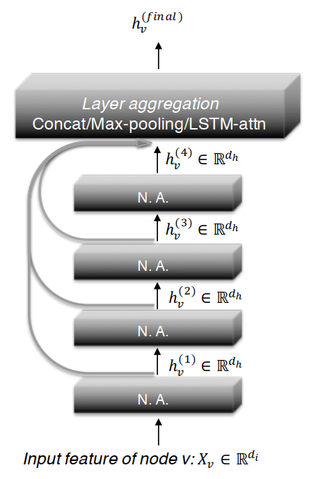

<!--
 * @Description:
 * @Author: Jianping Zhou
 * @Email: jianpingzhou0927@gmail.com
 * @Date: 2023-02-09 09:41:56
-->

# 过平滑问题

## 简介

尽管 GCN 为图数据的学习带来了一种全新的方式，然而 Li Q 等人在 Deeper Insights into Graph Convolutional Networks for Semi-Supervised Learning 中、Xu K 等人在 Representation Learning on Graphs with Jumping Knowledge Networks 中都明确指出了 GCN 模型无法像视觉任务中的 CNN 模型一样深度堆叠，一旦使用多层 GCN，相关任务的效果会急剧下降，这使得某些任务中，GCN 的能力非常有限。

## 实验测试

我在上次的节点分类任务基础上，不断增加 GCN，实验结果如下图所示（从左至右、从上至下 GCN 层数逐渐增加）。可以看到，2-3 层的 GCN 区分效果最好，5-6 层的 GCN，7 种节点已经逐渐混合在一起，很难区分了。

上面这个例子，可以发现，在使用多层 GCN 之后，节点的区分性越来越差，节点的表示向量趋于一致，这就使得以 GCN 为基础的后续学习任务难以进行。这个现象称为多层 GCN 的**过平滑（Over-smooth）问题**。

## 理论解释

众所周知，GCN 可以看作是一个低通滤波器（具体论证见 Revisiting Graph Neural Networks: All We Have is Low-Pass Filters 这篇文章），这种特性会造成信号变得更加平滑，这是 GCN 的内在优势，然而，过犹不及，多次进行这种信号平滑操作会使得信号趋于一致，这就丧失了节点特征的多样性。过平滑问题的理解可以从频域和空域两个角度出发，下面分别展开。

### **频域角度**

从 GCN 的频率响应函数$p(\lambda)=1-\tilde{\lambda}_{i}$中能看得明白些。

$$
\begin{aligned}
\lim _{k \rightarrow+\infty} \tilde{L}_{\mathrm{sym}}^{k} &=\lim _{k \rightarrow+\infty}\left(I-\tilde{L}_{s}\right)^{k} \\
&=\lim _{k \rightarrow+\infty}\left(V(1-\tilde{\Lambda}) V^{\mathrm{T}}\right)^{k} \\
&=\lim _{k \rightarrow+\infty} V\left[\begin{array}{lll}
\left(1-\tilde{\lambda}_{1}\right)^{k} \\
& \left(1-\tilde{\lambda}_{2}\right)^{k} \\
& & \ddots \\
& & & \left(1-\tilde{\lambda}_{N}\right)^{k}
\end{array}\right] V^T
\end{aligned}
$$

由于$\left(1-\tilde{\lambda}_{i}\right) \in(-1,1]$，当且仅当$i=1$时，$1-\tilde{\lambda}_1 = 1$，，由于其他的特征值都大于 0（假设全连通图，仅存在一个特征值为 0），因此上式取极限之后的结果如下式。

$$
\lim _{k \rightarrow+\infty} \tilde{L}_{\text {sym }}^{k}=V\left[\begin{array}{llll}
1 & & & \\
& 0 & & \\
& & \ddots & \\
& & & 0
\end{array}\right] V^{\mathrm{T}}
$$

若设图信号为$\boldsymbol{x}$，则有下面的结果，其中$\boldsymbol{v}_{1}$是$\tilde{L}_s$的最小频率$\tilde{\lambda}_1 = 0$对应的特征向量，$\tilde{x}_1$表示信号$\boldsymbol{x}$在对应频率$\tilde{\lambda}_1$的傅里叶系数。

$$
\lim _{k \rightarrow+\infty} \tilde{L}_{\text {sym }}^{k} x=V\left[\begin{array}{llll}
1 & & & \\
& 0 & & \\
& & \ddots & \\
& & & 0
\end{array}\right] V^{\mathrm{T}} \boldsymbol{x}=\left\langle\boldsymbol{x} \cdot \boldsymbol{v}_{1}\right\rangle \boldsymbol{v}_{1}=\tilde{x}_{1} \boldsymbol{v}_{1}
$$

由于$\tilde{L}_s \tilde{D}^{1 / 2} \mathbf{1}=\tilde{D}^{-1 / 2} L \tilde{D}^{-1 / 2} \tilde{D}^{1 / 2} \mathbf{1}=\tilde{D}^{-1 / 2} L \mathbf{1}=\tilde{D}^{-1 / 2} \mathbf{0}=\mathbf{0}$，即$\tilde{L}_{s}\left(\tilde{D}^{1 / 2} \mathbf{1}\right)=\mathbf{0}$。这是由于拉普拉斯矩阵$L$存在值全为 1 的特征向量，其对应特征值为 0。因此，$\boldsymbol{v}_{1}=\tilde{D}^{1 / 2} \mathbf{1}$是$\tilde{L}_s$在$\tilde{\lambda}_1$处的特征向量，该向量是一个处处相等的向量。所以，如果对一个图信号不断进行平滑操作，图信号就会变得处处相等，也就没有可区分性了。

### **空域角度**

Representation Learning on Graphs with Jumping Knowledge Networks 这篇论文中，作者从空域角度解释了为什么多层 GCN 效果不好的原因。空域来看，GCN 的本质是在聚合邻居信息，对于任意一个节点，节点特征每更新一次，就多聚合了更高一阶的邻居节点的信息。将最高邻居节点的阶数称为该节点的聚合半径，可以发现，随着 GCN 的层数增加，节点的聚合半径也在变大，一旦达到某个阈值，，该节点可覆盖的节点就会和全图节点一致。如果层数很多，每个节点覆盖的节点都会收敛到全图节点，这与哪个节点是无关的。这会导致每个节点的局部网络结构的多样性大大降低，对于节点自身特征的学习很不好。

上图是论文中的一个实验结果图，a 和 b 分别是对不同的方块节点进行信息聚合，可以看到，四层 GCN 后尽管两个节点的聚合半径一致，但是覆盖到的节点是差距很大的，但是对 b 再进行一次聚合后发现其覆盖节点迅速增加到达图的中心区域。此时，两个方块节点聚合的节点网络趋于一致，对其区分会很困难。

如何应对过平滑，论文中基于聚合半径和模型层数的关系提出了自适应性聚合半径的学习机制，其实现非常直观，就是通过增加跳跃连接来聚合模型的每层节点的输出，聚合后的节点特征拥有混合性的聚合半径，上层任务可对其进行选择性的监督学习，这样，对于任意一个节点而言，既不会因为聚合半径过大而出现过平滑的问题，也不会因为聚合半径过小，使得节点的结构信息不能充分学习。

上图是论文中这种学习机制的示意图，4 层图模型的输出都会通过跳跃连接与最终的聚合层相连，聚合可以采用拼接、最大池化等方法，聚合层的输出才是整个模型真正的输出，送入相应任务进行学习。

## 补充说明

过平滑是 GCN 存在的一个严重问题，也是制约其性能的关键，通过不同的方法解决过平滑问题为图网络的发展提供了契机。本文涉及的代码开源于[Github](https://github.com/luanshiyinyang/GNN)，欢迎 star 或者 fork。
