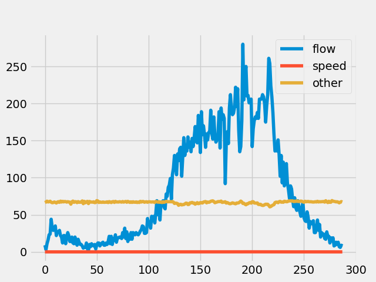

# 图网络交通流量预测

## 简介

随着图网络的发展，其在非欧氏数据上的应用被进一步开发，而交通预测就是图网络的一个主要应用领域。交通预测指的是根据历史交通数据和交通网络的拓扑结构来预测未来的交通状况，包括但不限于速度、流量、拥堵等。交通流量预测是其他上层任务如路径规划的基础，是工业界非常关心的任务。本文采用三种经典的图网络模型（GCN、ChebNet和GAT）进行图结构的交通流量预测，整个项目采用PyTorch实现，项目全部源码见文末Github地址。


## 数据准备

本文采用的是[ASTGCN](https://github.com/wanhuaiyu/ASTGCN)这篇采用图网络进行交通预测论文提供的数据集PEMS，包括PEMS04和PEMS08。其中PEMS04是2018年1月1日开始采集的连续59天的307的探测器获得的流量数据，每5分钟采集一次，所以原始流量数据data.npz读取后shape为`(307, 16992, 3)`，其中3维特征为flow, occupy, speed，原始邻接矩阵数据是一个distance.csv文件，它包含是`from,to,distance`的格式，方便起见，本文距离（对应图上的边权）只要节点相连都取1。相似的是，PEMS08是2016年7月1日开始采集的连续62天170个节点的流量数据，其数据shape为`(170, 17856, 3)`。

可以理解，构建的Graph上每个节点就是一个探测器获得的流量数据，每条边就是两个节点连接的权重。下图是对PEMS04中224号节点一天内的三种采集数据的可视化，可以看到只有流量数据起伏比较大，因此本文也只采用流量数据进行预测。

这里也给出PEMS的数据集[百度云链接](https://pan.baidu.com/s/1sN5EGV7gyEHAYvQMuZ503Q)(code:zczc)。



关于数据读取方面的内容，这里不多提及，对这种时序数据读取和预处理包括划分不熟悉的可以查看我文末的Github。

## 模型构建

首先是ChebNet模型的构建，它将SCNN中的谱域图卷积核替换为了切比雪夫多项式，如下式，最终要学习的只有$K+1$个参数，大大减少了SCNN巨大的参数量（拉普拉斯矩阵特征分解求解特征向量）。

$$
x \star_{G} g_{\theta}=U g_{\theta} U^{T} x =\sum_{k=0}^{K} \beta_{k} T_{k}(\hat{L}) x
$$

ChebNet的代码实现如下，不过，虽然减少了参数量，但是卷积核有了严格的空间局限性，$K$就是卷积核的“感受野半径”，即将距离中心节点$k$个节点作为邻域节点（$k = 1$时便相当于普通的3x3卷积，邻域为1）。

```python
class ChebConv(nn.Module):

    def __init__(self, in_c, out_c, K, bias=True, normalize=True):
        """
        ChebNet conv
        :param in_c: input channels
        :param out_c:  output channels
        :param K: the order of Chebyshev Polynomial
        :param bias:  if use bias
        :param normalize:  if use norm
        """
        super(ChebConv, self).__init__()
        self.normalize = normalize

        self.weight = nn.Parameter(torch.Tensor(K + 1, 1, in_c, out_c))  # [K+1, 1, in_c, out_c]
        init.xavier_normal_(self.weight)

        if bias:
            self.bias = nn.Parameter(torch.Tensor(1, 1, out_c))
            init.zeros_(self.bias)
        else:
            self.register_parameter("bias", None)

        self.K = K + 1

    def forward(self, inputs, graph):
        """

        :param inputs: he input data, [B, N, C]
        :param graph: the graph structure, [N, N]
        :return: convolution result, [B, N, D]
        """
        L = ChebConv.get_laplacian(graph, self.normalize)  # [N, N]
        mul_L = self.cheb_polynomial(L).unsqueeze(1)  # [K, 1, N, N]
        result = torch.matmul(mul_L, inputs)  # [K, B, N, C]
        result = torch.matmul(result, self.weight)  # [K, B, N, D]
        result = torch.sum(result, dim=0) + self.bias  # [B, N, D]

        return result

    def cheb_polynomial(self, laplacian):
        """
        Compute the Chebyshev Polynomial, according to the graph laplacian

        :param laplacian: the multi order Chebyshev laplacian, [K, N, N]
        :return:
        """
        N = laplacian.size(0)  # [N, N]
        multi_order_laplacian = torch.zeros([self.K, N, N], device=laplacian.device, dtype=torch.float)  # [K, N, N]
        multi_order_laplacian[0] = torch.eye(N, device=laplacian.device, dtype=torch.float)

        if self.K == 1:
            return multi_order_laplacian
        else:
            multi_order_laplacian[1] = laplacian
            if self.K == 2:
                return multi_order_laplacian
            else:
                for k in range(2, self.K):
                    multi_order_laplacian[k] = 2 * torch.mm(laplacian, multi_order_laplacian[k - 1]) - \
                                               multi_order_laplacian[k - 2]

        return multi_order_laplacian

    @staticmethod
    def get_laplacian(graph, normalize):
        """
        compute the laplacian of the graph
        :param graph: the graph structure without self loop, [N, N]
        :param normalize: whether to used the normalized laplacian
        :return:
        """
        if normalize:
            D = torch.diag(torch.sum(graph, dim=-1) ** (-1 / 2))
            L = torch.eye(graph.size(0), device=graph.device, dtype=graph.dtype) - torch.mm(torch.mm(D, graph), D)
        else:
            D = torch.diag(torch.sum(graph, dim=-1))
            L = D - graph
        return L


class ChebNet(nn.Module):

    def __init__(self, in_c, hid_c, out_c, K):
        """
        :param in_c: int, number of input channels.
        :param hid_c: int, number of hidden channels.
        :param out_c: int, number of output channels.
        :param K:
        """
        super(ChebNet, self).__init__()
        self.conv1 = ChebConv(in_c=in_c, out_c=hid_c, K=K)
        self.conv2 = ChebConv(in_c=hid_c, out_c=out_c, K=K)
        self.act = nn.ReLU()

    def forward(self, data, device):
        graph_data = data["graph"].to(device)[0]  # [N, N]
        flow_x = data["flow_x"].to(device)  # [B, N, H, D]

        B, N = flow_x.size(0), flow_x.size(1)

        flow_x = flow_x.view(B, N, -1)  # [B, N, H*D]

        output_1 = self.act(self.conv1(flow_x, graph_data))
        output_2 = self.act(self.conv2(output_1, graph_data))

        return output_2.unsqueeze(2)

```

接着是GCN模型的构建，按照下面的公式，先计算出标准化的拉普拉斯矩阵，再和$W$和$X$先后矩阵乘法，就得到了最后的输出。GCN是一个著名的谱域图卷积方法，它对ChebNet进行进一步简化，只采用一阶切比雪夫多项式，一个卷积核只有一个$\theta$需要学习，虽然卷积核减小了，但是通过多层堆叠可以获得卷积神经网络类似的能力。因此，GCN也被认为是谱域到空域的一个过渡方法。

$$
x \star_{G} g_{\theta}=\theta\left(\tilde{D}^{-1 / 2} \tilde{W} \tilde{D}^{-1 / 2}\right) x
$$

PyTorch实现GCN的源码如下。

```python
class GCN(nn.Module):
    def __init__(self, in_c, hid_c, out_c):
        """
        GCN
        :param in_c: input channels
        :param hid_c:  hidden nodes
        :param out_c:  output channels
        """
        super(GCN, self).__init__()
        self.linear_1 = nn.Linear(in_c, hid_c)
        self.linear_2 = nn.Linear(hid_c, out_c)
        self.act = nn.ReLU()

    def forward(self, data, device):
        graph_data = data["graph"].to(device)[0]  # [N, N]
        graph_data = self.process_graph(graph_data)

        flow_x = data["flow_x"].to(device)  # [B, N, H, D]

        B, N = flow_x.size(0), flow_x.size(1)

        flow_x = flow_x.view(B, N, -1)  # [B, N, H*D]  H = 6, D = 1

        output_1 = self.linear_1(flow_x)  # [B, N, hid_C]
        output_1 = self.act(torch.matmul(graph_data, output_1))  # [N, N], [B, N, Hid_C]

        output_2 = self.linear_2(output_1)
        output_2 = self.act(torch.matmul(graph_data, output_2))  # [B, N, 1, Out_C]

        return output_2.unsqueeze(2)

    @staticmethod
    def process_graph(graph_data):
        N = graph_data.size(0)
        matrix_i = torch.eye(N, dtype=graph_data.dtype, device=graph_data.device)
        graph_data += matrix_i  # A~ [N, N]

        degree_matrix = torch.sum(graph_data, dim=-1, keepdim=False)  # [N]
        degree_matrix = degree_matrix.pow(-1)
        degree_matrix[degree_matrix == float("inf")] = 0.  # [N]

        degree_matrix = torch.diag(degree_matrix)  # [N, N]

        return torch.mm(degree_matrix, graph_data)  # D^(-1) * A = \hat(A)
```

最后，是空域里比较经典的图注意力网络GAT，它将注意力机制引入了图卷积模型之中。论文作者认为邻域中所有的节点共享一个相同的卷积核参数会限制模型的能力，因为邻域内每一个节点和中心节点的关联度是不一样的，所以在进行卷积操作时，需要对邻域节点“区别对待”，作者采用的是attention机制来对中心节点和邻域节点的关联度进行建模。它的具体步骤如下（详细算法流程请查看原文）：
1. 计算节点之间的关联度
$$
e_{i j}=\alpha\left(\mathbf{w} \vec{h}_{i}, \mathbf{W} \vec{h}_{j}\right)=\vec{a}^{T}\left[\mathbf{W} \vec{h}_{i} \| \mathbf{W} \vec{h}_{j}\right]
$$
2. 使用softmax函数对每个节点的注意力系数进行归一化
$$
\alpha_{i j}=\operatorname{softmax}_{j}\left(e_{i j}\right)=\frac{\exp \left(e_{i j}\right)}{\sum_{k \in \mathcal{N}_{i}} \exp \left(e_{i k}\right)}
$$
3. 利用上述得到的注意力系数对邻域节点进行有区别的信息聚合，其中，$\alpha_{ij}$便是softmax归一化之后的注意力系数，$W$为共享的卷积核参数，$\vec{h}_{j}$为节点特征。
$$
\vec{h}_{i}^{\prime}=f\left(\sum_{j \in \mathcal{N}_{i}} \alpha_{i j} \mathbf{W} \vec{h}_{j}\right)
$$

GAT的代码实现如下，我这里采用了多头注意力。

```python
class GraphAttentionLayer(nn.Module):
    def __init__(self, in_c, out_c, alpha=0.2):
        """
        graph attention layer
        :param in_c:
        :param out_c:
        :param alpha:
        """
        super(GraphAttentionLayer, self).__init__()
        self.in_c = in_c
        self.out_c = out_c
        self.alpha = alpha

        self.W = nn.Parameter(torch.empty(size=(in_c, out_c)))
        nn.init.xavier_uniform_(self.W.data, gain=1.414)
        self.a = nn.Parameter(torch.empty(size=(2 * out_c, 1)))
        nn.init.xavier_uniform_(self.a.data, gain=1.414)
        self.leakyrelu = nn.LeakyReLU(self.alpha)

    def forward(self, features, adj):
        B, N = features.size(0), features.size(1)
        adj = adj + torch.eye(N, dtype=adj.dtype).cuda()  # A+I
        h = torch.matmul(features, self.W)  # [B,N,out_features]
        # [B, N, N, 2 * out_features]
        a_input = torch.cat([h.repeat(1, 1, N).view(B, N * N, -1), h.repeat(1, N, 1)], dim=2).view(B, N, -1, 2 * self.out_c)
        e = self.leakyrelu(torch.matmul(a_input, self.a).squeeze(3))  # [B,N, N, 1] => [B, N, N]
        zero_vec = -1e12 * torch.ones_like(e)
        attention = torch.where(adj > 0, e, zero_vec)  # [B,N,N]
        attention = F.softmax(attention, dim=2)  # softmax [N, N]
        # attention = F.dropout(attention, 0.5)
        h_prime = torch.matmul(attention, h)  # [B,N, N]*[N, out_features] => [B,N, out_features]
        return h_prime

    def __repr__(self):
        return self.__class__.__name__ + ' (' + str(self.in_features) + ' -> ' + str(self.out_features) + ')'


class GAT(nn.Module):
    def __init__(self, in_c, hid_c, out_c, n_heads=8):
        """
        :param in_c: int, number of input channels.
        :param hid_c: int, number of hidden channels.
        :param out_c: int, number of output channels.
        :param K:
        """
        super(GAT, self).__init__()
        self.attentions = nn.ModuleList([GraphAttentionLayer(in_c, hid_c) for _ in range(n_heads)])
        # self.conv1 = GraphAttentionLayer(in_c, hid_c)
        self.conv2 = GraphAttentionLayer(hid_c * n_heads, out_c)
        self.act = nn.ReLU()

    def forward(self, data):
        # data prepare
        adj = data["graph"][0]  # [N, N]
        x = data["flow_x"]  # [B, N, H, D]
        B, N = x.size(0), x.size(1)
        x = x.view(B, N, -1)  # [B, N, H*D]

        # forward
        outputs = torch.cat([attention(x, adj) for attention in self.attentions], dim=-1)
        outputs = self.act(outputs)
        # output_1 = self.act(self.conv1(flow_x, adj))
        output_2 = self.act(self.conv2(outputs, adj))

        return output_2.unsqueeze(2)  # [B,1,N,1]
```


## 训练实验

我这边当作一个回归任务来看，采用比较基础的MSE损失和Adam+SGD的训练策略，同等配置下训练并测试ChebNet、GCN和GAT，进行可视化，结果如下图。训练代码有点长，就不贴了，感兴趣的可以访问文末Github。


上图可以看到，ChebNet靠着较大的复杂性和理论基础，在这个任务取得了不错的效果，而GAT虽然没有ChebNet强悍但胜在灵活，GCN则比较一般。


最后做个总结，本文只是对几个图卷积模型进行了简单的实验，事实上三个模型都有类似`flow_x = flow_x.view(B, N, -1)`的代码段，这代表我们将时序数据拼接到了一起，这就无疑等同于放弃了时间信息，实际上，对于这种时序任务，时间信息是至关重要的，像STGCN、ASTGCN、DCRNN等方法都是考虑时序特征才获得了很不错的效果。

## 补充说明

本文在PEMS数据集上进行了交通流量预测，项目和博客书写过程中参考了[一篇博文](https://blog.csdn.net/weixin_45901519/article/details/107864572)，在他的基础上我进行了完善。完整的代码开放在[Github](https://github.com/luanshiyinyang/GNN)上，欢迎star和fork。


